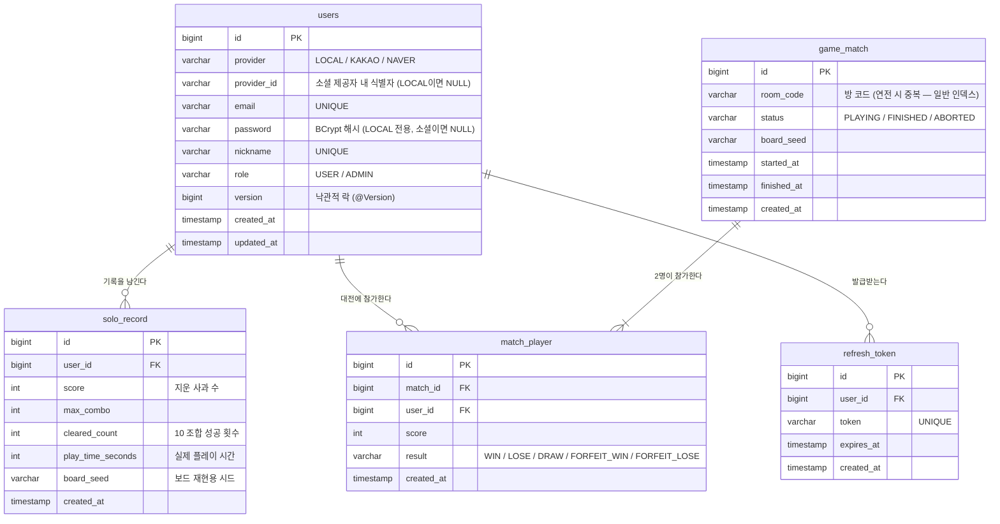

# ERD — MyAppleGame

## 설계 원칙

- **MySQL** : 영속 데이터만 저장 — 회원, 끝난 게임의 기록, 대전 결과.
- **Redis** : 진행 중인 게임의 휘발성 상태 — 보드, 방 상태, 랭킹 캐시, 락.
- 게임 진행 중에는 DB에 쓰기가 발생하지 않고, **게임 종료 시점에만 결과를 정산**하여 저장합니다 (write-behind → DB 쓰기 부하 학습 포인트).

---

## 1. MySQL ERD



### 테이블 설명

#### `users`
- 일반 회원가입(`LOCAL`)과 소셜 로그인(`KAKAO`, `NAVER`) 사용자를 한 테이블로 관리.
  - `LOCAL`: `email` + `password`(BCrypt)로 로그인, `provider_id`는 NULL.
  - `KAKAO`/`NAVER`: `(provider, provider_id)` 복합 UNIQUE로 식별, `password`는 NULL.
- `version` 컬럼: 결과 정산 등 동시 수정 상황에서 **낙관적 락** 실습용.

#### `refresh_token`
- JWT 재발급용 리프레시 토큰. 로그아웃 시 삭제.
- 학습 확장: DB 대신 **Redis에 TTL로 저장**하는 방식으로 전환해 조회 성능 비교 가능.

#### `solo_record`
- 솔로 모드 1판 = 1행. 한 유저가 여러 기록을 가짐 (개인 최고 기록은 쿼리로 집계).
- `board_seed`: 동일 보드를 재현할 수 있게 저장 (리플레이/검증용).
- **DB 성능 학습의 중심 테이블** — 더미 데이터 100만 건을 넣고 랭킹/기간별 조회를 튜닝합니다.

#### `game_match`
- 대전 1판 = 1행. 방이 게임을 시작하면 생성되고, 종료 시 `status`와 `finished_at`이 갱신됩니다.
- 같은 방에서 연전하면 `room_code`가 같은 행이 여러 개 쌓입니다 (`room_code`는 UNIQUE가 아님 — 방 조회는 Redis 담당).
- **방 단위 누적 점수는 MySQL에 저장하지 않습니다** — 한 명이 나가면 사라지는 휘발성 상태이므로 Redis(`room:{code}:total:{userId}`)에서 관리하고, 판별 기록만 이 테이블에 영속화합니다.
- `ABORTED`: 시작 후 양쪽 모두 이탈 등 비정상 종료.

#### `match_player`
- 대전 참가자별 결과. `game_match` 1건당 정확히 2행.
- `(match_id, user_id)` 복합 UNIQUE — 같은 판에 중복 참가 방지.
- `FORFEIT_*`: 상대 이탈로 인한 몰수승/패.

---

## 2. 인덱스 설계 (DB 성능 학습 포인트)

| 테이블 | 인덱스 | 대상 쿼리 | 학습 내용 |
|---|---|---|---|
| `solo_record` | `(score DESC, id DESC)` | 전체 랭킹 TOP N | 정렬 인덱스, 커버링 인덱스 |
| `solo_record` | `(user_id, created_at DESC)` | 내 기록 최신순 조회 | 복합 인덱스 순서의 중요성 |
| `solo_record` | `(created_at, score DESC)` | 주간/일간 랭킹 | 기간 필터 + 정렬 조합 |
| `match_player` | `(user_id, created_at DESC)` | 내 대전 전적 | fetch join과 함께 N+1 해결 |
| `game_match` | `(room_code, id)` | 방 코드로 판 이력 조회 | 일반 인덱스 (연전으로 room_code 중복 허용) |

> 각 인덱스는 **적용 전/후 `EXPLAIN ANALYZE` 결과를 기록**하며 비교하는 것이 목표입니다.
> 랭킹 조회는 offset 페이지네이션 → no-offset(커서) 방식으로 개선하는 실습을 포함합니다.

---

## 3. Redis 데이터 모델 (진행 중 게임 상태)

| Key | Type | 내용 | TTL |
|---|---|---|---|
| `room:{roomCode}` | Hash | 방 상태 (status, hostId, guestId, matchId, round) | 방 해체 시 정리 |
| `room:{roomCode}:total:{userId}` | String | **방 단위 누적 점수** — 판이 끝날 때마다 `INCRBY`. 한 명이라도 방을 나가면 삭제(초기화) | 방 해체/이탈 시 정리 |
| `room:{roomCode}:board` | Hash | 보드 상태 — field: `r{row}c{col}`, value: 사과 숫자 (제거되면 field 삭제) | 게임 종료 후 정리 |
| `room:{roomCode}:score:{userId}` | String | 플레이어별 실시간 점수 (`INCRBY`) | 게임 종료 후 정리 |
| `lock:room:{roomCode}` | String | 방 단위 분산 락 (`SETNX` / Redisson) | 락 리스 시간 |
| `ranking:solo:alltime` | **Sorted Set** | 전체 랭킹 캐시 — member: userId, score: 최고 점수 | 없음 (동기화 관리) |
| `ranking:solo:weekly:{yyyyWW}` | **Sorted Set** | 주간 랭킹 | 2주 |
| `ws:session:{sessionId}` | String | WebSocket 세션 → userId/roomCode 매핑 (이탈 감지용) | 연결 종료 시 삭제 |

### 동시성 핵심: 사과 제거의 원자적 처리

두 플레이어가 같은 사과를 동시에 지우려 할 때, 아래 로직이 **원자적으로** 실행되어야 합니다.

```
1. 선택 영역의 사과들이 아직 모두 존재하는가? (HMGET)
2. 합이 10인가?
3. 존재하고 합이 맞으면 → 제거(HDEL) + 점수 가산(INCRBY)
```

이를 **Lua Script 한 번의 호출**로 처리하면 Redis의 단일 스레드 특성상 경합이 원천 차단됩니다.
비교 실습으로 다음 3가지 방식을 구현해 성능/정합성을 측정합니다:

1. 락 없음 (버그 재현용 — 중복 득점 발생 확인)
2. 분산 락 (Redisson `RLock`) 획득 후 검증/제거
3. Lua Script 원자 실행 ← 최종 채택 예정

---

## 4. 데이터 흐름 요약

```
[대전 모드 — 같은 방에서 연전 가능]
방 생성 ──► Redis room:{code} 생성
판 시작 ──► game_match INSERT (PLAYING) + Redis 보드 생성 (round 증가)
사과 제거 ──► Redis Lua (검증+제거+점수) ──► WebSocket 브로드캐스트
판 종료 ──► match_player 결과 INSERT, game_match FINISHED 갱신
        ──► room:{code}:total:{userId} INCRBY (누적 점수) ──► GAME_END에 totalScores 포함
        ──► 보드 키만 정리, 방은 유지 (다시 ready → 다음 판)
플레이어 퇴장 ──► PLAYER_LEFT 브로드캐스트 + 누적 점수/round 초기화 (방은 WAITING으로)
방 해체 ──► Redis 방/누적 키 전체 정리

[솔로 모드]
게임 시작 ──► 서버가 보드 시드 발급 (Redis에 세션 보관)
게임 종료 ──► solo_record INSERT + ranking Sorted Set 갱신 (ZADD GT)
```
